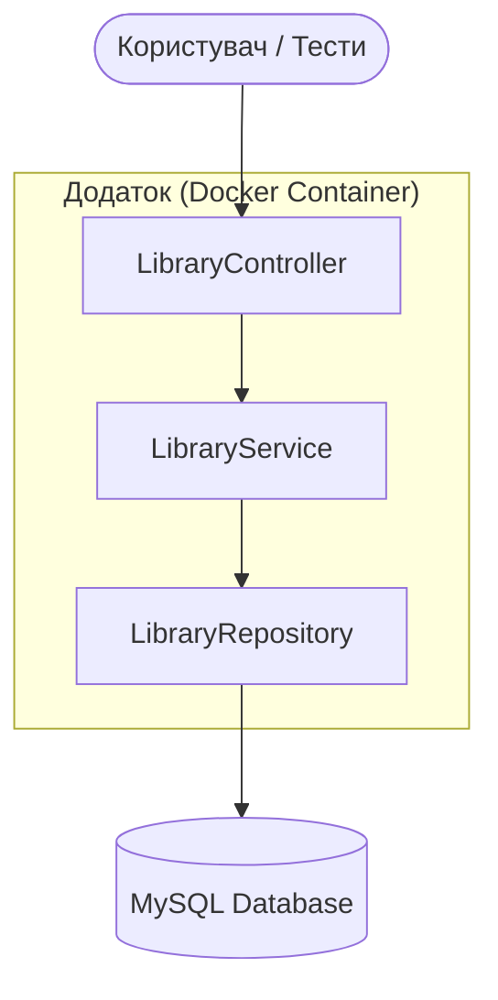
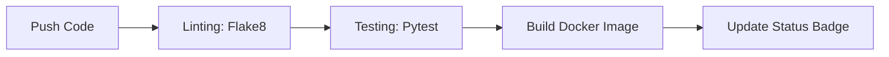

# Library Project (Lab 5)


Проєкт демонструє реалізацію базової бізнес-логіки бібліотеки з архітектурою **Controller–Service–Repository** та автоматизацією через Docker та GitHub Actions.

---

## 🏗 Архітектура та основні етапи

Проєкт побудований на принципах чистої архітектури. Нижче наведено структурну схему взаємодії компонентів:

### Структурна схема сервісу


### Етапи обробки запиту:
1. **Controller**: Приймає дані, валідує DTO та передає запит далі.
2. **Service**: Містить бізнес-логіку (перевірка лімітів, наявність книг).
3. **Repository**: Виконує операції з даними (збереження, пошук).
4. **Database**: Забезпечує збереження стану (MySQL).

---

## 🚀 CI/CD Конвеєр (GitHub Actions)
Кожен комміт проходить через наступний цикл автоматизації:



---

## 🛠 Змінні середовища (Environment Variables)
Для роботи додатка (особливо в Docker) використовуються наступні змінні:

| Змінна | Опис | Значення за замовчуванням |
| :--- | :--- | :--- |
| `DB_HOST` | Адреса сервера бази даних | `db` (в Docker) / `localhost` |
| `DB_PORT` | Порт бази даних | `3306` |
| `DB_NAME` | Назва бази даних | `library_db` |
| `DB_USER` | Ім'я користувача БД | `user` |
| `DB_PASSWORD` | Пароль користувача БД | `password` |

---

## 🐳 Запуск через Docker (Рекомендовано)

Найпростіший спосіб запустити проєкт та базу даних:

1. **Збірка та запуск всього стеку:**
   ```bash
   docker-compose up --build
   ```
2. **Запуск тестів у контейнері:**
   ```bash
   docker-compose run --rm tests
   ```
3. **Зупинка проєкту:**
   ```bash
   docker-compose down
   ```

---

## 💻 Локальний запуск (без Docker)

Якщо ви хочете запустити додаток безпосередньо на вашій ОС:

1. **Створіть віртуальне середовище:**
   ```bash
   python -m venv venv
   source venv/bin/scripts/activate  # для Windows: venv\Scripts\activate
   ```
2. **Встановіть залежності:**
   ```bash
   pip install -r requirements.txt
   ```
3. **Запустіть тести:**
   ```bash
   python -m pytest
   ```

---

## 📖 Опис API / Бізнес-логіки (Контролери)

Хоча додаток наразі не має HTTP-сервера, логіка розділена на методи контролера `LibraryController`, які можна викликати як API-запити:

### Користувачі
- **POST /register_user**: Реєстрація нового читача.
  - *Параметри:* `name`, `email`.
- **GET /search_books**: Пошук книг за назвою або автором.
  - *Параметри:* `query`.

### Книги
- **POST /borrow_book**: Видача книги користувачу.
  - *Параметри:* `user_id`, `book_id`.
- **POST /return_book**: Повернення книги в бібліотеку.
  - *Параметри:* `book_id`.

---

## 🧪 Тестування

Тести покривають основні бізнес-сценарії (успішна видача, помилки при перевищенні ліміту, повернення тощо).

- **Команда для запуску:** `python -m pytest`
- **Що очікувати:** Ви побачите список пройдених тестів (10 passed). Якщо CI-конвеєр на GitHub світиться зеленим — тести пройшли успішно.

---

## ✅ Як перевірити результат

1. **Через тести:** Запустіть `docker-compose run --rm tests`. Якщо в кінці написано `10 passed`, система працює коректно.
2. **Через логи:** При запуску `docker-compose up` ви побачите лог підключення до бази даних та ініціалізації сервісів.
3. **GitHub Actions:** Перейдіть у вкладку **Actions** вашого репозиторію, щоб побачити статус автоматичної збірки.

---

## 🏗 Структура проєкту
- `src/controllers/` — вхідна точка логіки.
- `src/services/` — бізнес-логіка (перевірки, правила).
- `src/repositories/` — доступ до даних (InMemory/MySQL).
- `tests/` — юніт-тести.
